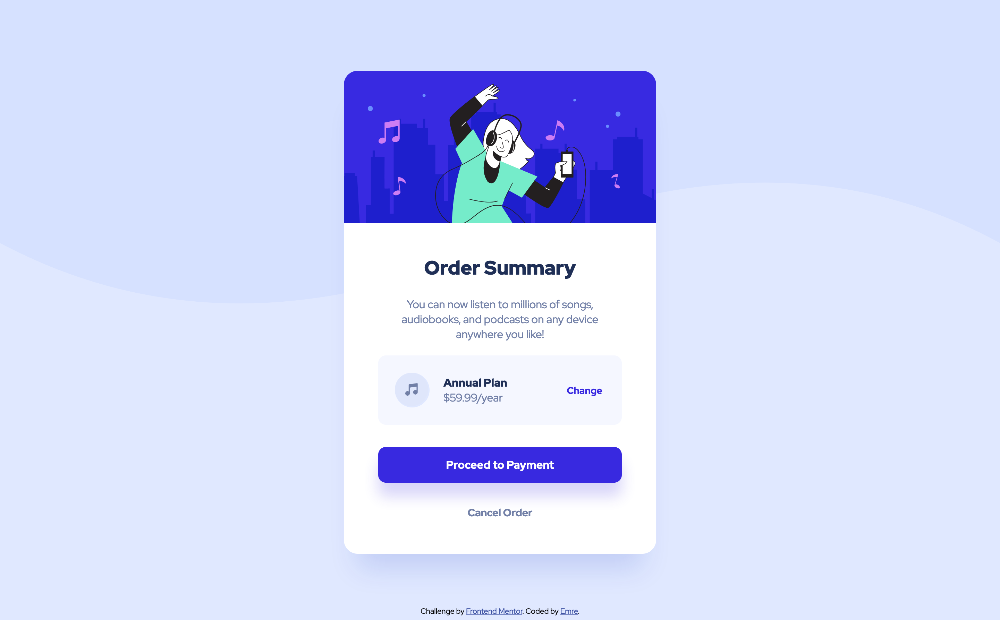

# Frontend Mentor - Order summary card solution

This is a solution to the [Order summary card challenge on Frontend Mentor](https://www.frontendmentor.io/challenges/order-summary-component-QlPmajDUj).

## Table of contents

- [Frontend Mentor - Order summary card solution](#frontend-mentor---order-summary-card-solution)
  - [Table of contents](#table-of-contents)
  - [Overview](#overview)
    - [The challenge](#the-challenge)
    - [Screenshot](#screenshot)
    - [Links](#links)
  - [My process](#my-process)
    - [Built with](#built-with)
    - [Differences between `style-guide.md` and the `Figma` file.](#differences-between-style-guidemd-and-the-figma-file)
  - [Author](#author)

## Overview

### The challenge

Users should be able to:

- See hover states for interactive elements

### Screenshot

Screenshot of my solution.

### Links

- Solution URL: [https://www.frontendmentor.io/solutions/order-summary-card-solution-with-flexbox-whpK1qG6T](https://www.frontendmentor.io/solutions/order-summary-card-solution-with-flexbox-whpK1qG6T)
- Live Site URL: [https://emreyyz.github.io/frontendmentor-001/](https://emreyyz.github.io/frontendmentor-001/)

## My process

### Built with

- Semantic HTML5 markup
- CSS custom properties
- Flexbox

### Differences between `style-guide.md` and the `Figma` file.

There were big differences between the 2 files:

- Style guide does not include the font-weight 400. However, 400 font weight is required to be able to complete the design. Font weight 500 is unnecessary and is not included in the final design.
- Shadow data were not mentioned in the `style-guide.md`. These are required to be able to finish the design accurately. The Figma file has them.
- Some of the core color values given in the `style-guide.md` are different than the values in the Figma file.

These two made me lose a little bit of time but actually made the process much more fun, otherwise it is pretty easy to complete the challenge.

## Author

- Website - [Emre C. Aydin](https://emre.la)
- Frontend Mentor - [@EmreYYZ](https://www.frontendmentor.io/profile/EmreYYZ)
- Twitter - [@MostlyEmre](https://twitter.com/MostlyEmre)
